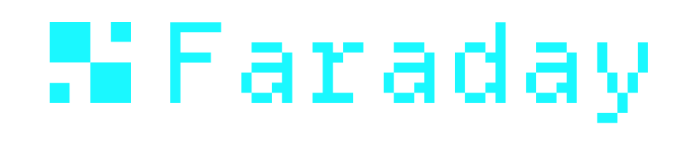

<div align="center">
  
  <p><strong>Air-gapped Solana signer. $35 in parts. Pure Rust.</strong></p>
</div>

---

## Why Faraday exists

Hot wallets get drained. Hardware wallets cost $80–$200, lock you into proprietary firmware, and most still trust a USB cable to the same machine that just clicked the malicious link.

Faraday is a **DIY hardware signer for Solana** built on a Raspberry Pi Zero 1.3 — a board with **no WiFi, no Bluetooth, no network silicon at all**. The only way data crosses the air gap is QR codes scanned through the Pi camera. Total bill of materials: ~$35.

Everything is open source: firmware, OS image recipe, browser extension, mobile companion. You can audit it, fork it, build your own, and verify the binary you flash matches the source you read.

## How it works

```
 [Phone / Laptop]                      [Faraday (air-gapped)]
       |                                        |
       |  1. Build unsigned transaction         |
       |  2. Display as QR code          -----> |  3. Scan QR with camera
       |                                        |  4. Display transaction details
       |                                        |  5. User reviews & approves
       |  7. Scan signed QR back         <----- |  6. Sign & display signed QR
       |  8. Submit to Solana network           |
       |                                        |
       |  Private key NEVER crosses this gap    |
```

Every transaction is **decoded and shown in human terms** before signing — Jupiter swaps, Raydium swaps, SPL transfers, stake operations, Anchor program calls, all parsed offline without touching an RPC. See [Transaction parser](#transaction-parser).

## What's in this repo

| Path | What it is |
|------|------------|
| [`src/`](src) | Rust firmware for the Pi Zero — also runs as a desktop simulator (`cargo run --features simulator`) for development |
| [`opt/`](opt) | Buildroot recipe that produces the Pi OS image. See [`opt/README.md`](opt/README.md) |
| [`extension/`](extension) | Chromium browser extension — Wallet Standard companion that relays dapp signing requests to Faraday over QR. See [`extension/README.md`](extension/README.md) |
| [`mobile/`](mobile) | React Native + Expo wallet for the Solana Seeker phone (work in progress). See [`mobile/README.md`](mobile/README.md) |
| [`playground/`](playground) | Vite devnet dapp for exercising the extension end-to-end. See [`playground/README.md`](playground/README.md) |
| [`site/`](site) | Next.js marketing site (separate deploy target) |
| [`testdata/`](testdata) | Real mainnet transactions captured for parser tests. See [`testdata/README.md`](testdata/README.md) |
| [`scripts/`](scripts) | Helper scripts (e.g. `fetch_alt.py` to capture frozen Address Lookup Tables) |
| [`assets/`](assets) | Brand SVGs, fonts, printable SeedQR templates |

## Hardware

| Component | Model | Purpose |
|-----------|-------|---------|
| Computer | Raspberry Pi Zero 1.3 | No WiFi/BT chip on this revision (v1.3, **not** Zero W) |
| Display | Waveshare 1.3" LCD HAT | 240×240, ST7789, 3 buttons + joystick |
| Camera | Pi Camera v1.3 (OV5647) | QR code scanning + entropy capture |

Total cost: **~$35**. Any Pi Zero v1.3 or 2 W with WiFi physically removed/disabled also works, but the original Zero is the simplest because the chip just isn't there.

## Quick start (desktop simulator)

You don't need any hardware to try Faraday — the same code that runs on the Pi runs on macOS/Linux/Windows with a webcam.

```bash
cargo run --features simulator
```

A 240×240 window opens. Pick `CREATE → 12 WORDS → RANDOM` to generate a wallet with on-screen entropy.

| Key | Hardware button | Action |
|-----|-----------------|--------|
| Arrow keys | Joystick | Navigate |
| Enter / Z | Key1 / JoyPress | Confirm |
| X | Key2 | Secondary action |
| Escape | Key3 | Back / Cancel |

## End-to-end demo (simulator + extension + playground)

Run all three locally — no Pi needed — to see the full sign flow.

**1. Simulator:**
```bash
cargo run --features simulator
```
Create a wallet (`CREATE → 12 WORDS → RANDOM`) or load an existing one. Leave it running.

**2. Extension** (in a second terminal):
```bash
cd extension
pnpm install
pnpm run dev
```
WXT builds to `extension/.output/chrome-mv3/`. Load it in Chrome:
1. Open `chrome://extensions`, toggle **Developer mode** on
2. Click **Load unpacked** → pick `extension/.output/chrome-mv3/`

**3. Playground** (in a third terminal):
```bash
cd playground
pnpm install
pnpm run dev
```
Opens at <http://localhost:4173>.

**4. Drive the loop:**
1. Click the Faraday extension icon → **Pair** to your simulator's pubkey (shown on `MAIN MENU → SETTINGS → ADDRESS`)
2. In the playground, click **Connect** → approve in the extension
3. Click **Airdrop 1 SOL** (devnet)
4. Click **Sign + send transfer** → unsigned tx QR appears in the extension's sign window
5. Point the simulator's camera at the QR → review → approve → it shows the signed QR
6. Scan the signed QR back in the extension → playground broadcasts → check the explorer link

[`extension/README.md`](extension/README.md) and [`playground/README.md`](playground/README.md) have details and troubleshooting.

## Building the Pi OS image

The OS is a minimal Buildroot Linux that boots straight into the Faraday binary, with no networking, no shell on the framebuffer, and a read-only root.

```bash
# 1. Cross-compile the ARM binary
cargo install cargo-zigbuild
cargo zigbuild --release --target arm-unknown-linux-gnueabihf

# 2. Build the OS image (uses Docker — first build takes ~30 min, cached rebuilds are fast)
docker compose up

# 3. Flash to SD card (find your device with `diskutil list` first)
just flash DEVICE=/dev/diskN
```

Image lands at `images/faraday_os.pi0.img`. See [`opt/README.md`](opt/README.md) for what's inside the OS, what's stripped out, and how to customize it.

## `just` commands

```
just sim          # Run the desktop simulator
just arm          # Cross-compile the ARM binary for Pi Zero
just image        # Build the full Pi OS image (cold Buildroot — slow)
just image-fast   # Rebuild reusing warm Buildroot state
just flash DEVICE # Flash to SD card (DEVICE=/dev/diskN)
just ext          # Build the browser extension
just test         # cargo test
just check        # Type-check both simulator and Pi targets
```

## Transaction parser

Faraday decodes Solana transactions before signing so users see human-readable details instead of raw bytes. Both legacy and v0 (versioned) transaction formats are supported. **All decoding happens offline — no RPC.**

| Program | Instructions decoded |
|---------|---------------------|
| System | Transfer, CreateAccount, CreateAccountWithSeed, Allocate, TransferWithSeed |
| SPL Token / Token-2022 | Transfer, TransferChecked, Approve, ApproveChecked, Revoke, MintTo, MintToChecked, Burn, BurnChecked, CloseAccount |
| Stake | Initialize, DelegateStake, Split, Withdraw, Deactivate, Merge |
| Jupiter v6 | Route, RouteV2, SharedAccountsRoute, ExactOutRoute, RouteWithTokenLedger (10 variants) |
| Jupiter Ultra / RFQ | Swap variants with RFQ pricing |
| DFlow | Swap (heuristic decode of trailing footer) |
| Raydium AMM v4 | SwapBaseIn, SwapBaseOut |
| Raydium CLMM | Swap, SwapV2 |
| Raydium CPMM | SwapBaseInput, SwapBaseOutput |
| Associated Token | CreateAccount |
| ComputeBudget | SetComputeUnitLimit, SetComputeUnitPrice |
| Memo | Inline memo text |
| Unknown | Program ID + raw data shown with a warning |

For Jupiter swaps, mints are resolved offline through a hardcoded registry of ~30 well-known tokens (SOL, USDC, JUP, etc.) plus deterministic ATA derivation — no network call. When a mint can't be resolved, a warning is shown instead of a misleading symbol.

To add a new program:
1. Create `src/parser/<program>.rs` with `pub fn parse(data, accounts) -> ParsedInstruction`
2. Register the program ID in `src/parser/programs.rs`
3. Add a match arm in `dispatch()` in `src/parser/mod.rs`

## QR payload format

QR codes carry base64-encoded payloads. A single prefix byte determines the type:

| First byte | Type | Payload |
|------------|------|---------|
| `0x00`–`0xFE` | Transaction | Standard Solana serialized transaction (legacy or v0) |
| `0xFF` | Sign Message | Arbitrary message bytes (remaining bytes after the prefix) |

Transactions use no prefix — the first byte is `num_signatures` (typically `0x01`), which is always a valid transaction header. The `0xFF` prefix is reserved for messages because no valid transaction can have 255 signatures.

For payloads that exceed a single QR's capacity, Faraday uses [UR](https://github.com/BlockchainCommons/Research/blob/master/papers/bcr-2020-005-ur.md) (Uniform Resource) animated QR streams.

## Security model

1. **No network hardware.** Pi Zero 1.3 has no WiFi/Bluetooth chip — not "disabled", physically absent.
2. **RAM-only keys.** Seeds never touch persistent storage. Power off = keys gone. The OS rootfs is read-only.
3. **Verifiable transactions.** Full decoded details shown on-screen before signing. The user is the final approval.
4. **Open source, reproducible.** All firmware, OS recipe, and companion apps are auditable. Cross-compile + Buildroot make the build deterministic given the same toolchain.
5. **Minimal surface.** No web server, no daemon, no SSH, no shell on the framebuffer.
6. **Pre-sign risk analysis** (in the browser extension) catches drainer patterns — unlimited approvals, ownership changes, token impersonators, simulated balance drops — before the signing QR is even displayed.

## BIP39 wordlist

The wordlist is **not bundled** in the repo. At build time, `build.rs` fetches it directly from the canonical [bitcoin/bips](https://github.com/bitcoin/bips/blob/master/bip-0039/english.txt) repository and verifies the SHA256 checksum. If the hash doesn't match, the build fails. No trust required — verify the constant in `build.rs` yourself.

## Derivation path

Solana standard: `m/44'/501'/0'/0'` (all hardened, Ed25519/SLIP-0010)

- `44'` — BIP-44 purpose (multi-account HD wallets)
- `501'` — Solana coin type
- `0'` — account index
- `0'` — address index (all hardened because Ed25519/SLIP-0010 doesn't support non-hardened derivation)

Compatible with Phantom, Solflare, and other Solana wallets — the seed you create on Faraday can be restored in any standards-compliant Solana wallet, and vice versa.

## License

Business Source License 1.1 — see [LICENSE](LICENSE).

You may use, copy, and modify the code for non-production purposes (learning, testing, personal use, contributions). Production and commercial use requires a license from the author. The code converts to Apache 2.0 on 2030-04-16.
